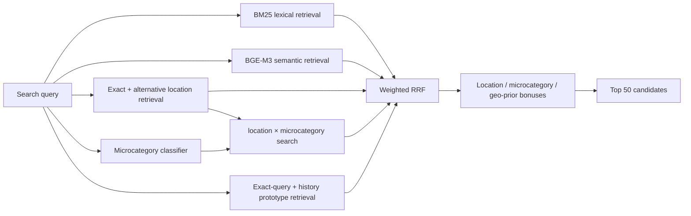

# Avito Data Science Bootcamp 2026 — Candidate Retrieval

**A hybrid retrieval pipeline for service-search candidate generation.**

> **Platform Recall@50: 0.831562**

The task is to return the 50 most relevant service listings for each search query. Because the target metric is Recall@50, the system is designed around **candidate coverage first**: independent retrieval signals generate complementary candidate sets, and a lightweight fusion layer combines them without overfitting a heavy reranker.

| | |
| --- | --- |
| **Objective** | retrieve 50 relevant service listings per query |
| **Primary metric** | Recall@50 |
| **Final score** | **0.831562** on the platform |
| **Retrieval** | BM25 + BAAI/bge-m3 + location-aware + microcategory-aware + history-based signals |
| **Fusion** | weighted Reciprocal Rank Fusion with small calibrated bonuses |
| **Validation** | query-disjoint splits; separate tuning and verification slices |
| **Reproducibility** | deterministic asset-building scripts + exact submitted `answer.csv` + SHA-256 integrity check |

## Retrieval architecture



## Why the final system looks like this

The strongest gains came from adding **independent recall sources**, not from stacking increasingly complex rerankers.

- **BM25** captures exact lexical overlap in title, structured parameters and description.
- **BGE-M3** recovers semantically related listings that lexical matching misses.
- **Exact and alternative location retrieval** addresses the strong geographic prior of service search.
- **Microcategory prediction** narrows retrieval toward the likely service type.
- **Location × microcategory search** combines the two strongest structural priors.
- **Exact-query history** recovers previously observed query/item relationships.
- **Embedding history prototypes** generalize historical relevance beyond exact repeated queries.
- **Weighted RRF** merges heterogeneous rankers without forcing their raw scores onto one scale.

Each source was added only after it improved held-out validation.

## Validation discipline

Most experiments use query-disjoint validation: the same `search_query` is not allowed to appear in both training and validation data.

For important changes, two non-overlapping validation ranges are used:

1. a **tuning slice** for selecting parameters;
2. a **verification slice** for checking the already-selected configuration.

This is intentionally stricter than selecting on one repeatedly reused validation split.

### Approaches tested but not shipped

Several ideas improved a tuning slice or added complexity without stable verification gains, so they were excluded from the final pipeline:

- base cross-encoder reranking;
- fine-tuned reranker;
- separate BM25 indexes per field;
- microcategory-conditioned geographic prior;
- candidate transfer between similar queries.

Keeping these out is part of the result: the repository preserves the simpler configuration that survived verification.

## Signals used

| Signal | Role |
| --- | --- |
| `search_query` | primary lexical and semantic query signal |
| `search_infm_params_text` | structured query parameters for exact matching |
| `item_title_raw` | strongest listing text field |
| `item_description_raw` | additional semantic context |
| `item_infm_params_text` | structured listing information |
| `search_location_id`, `item_location_id` | geographic relevance |
| `item_microcat_id` | service-type restriction |
| historical `query → item` pairs | exact history and embedding prototype retrieval |

## Repository map

| Path | Purpose |
| --- | --- |
| `solution.py` | final candidate generation and fusion pipeline |
| `build_train_assets.py` | BGE embeddings and BM25 index for training data |
| `build_benchmark_assets.py` | BGE embeddings and BM25 index for benchmark items |
| `microcat_classifier.py` | query → microcategory classifier |
| `experiments/` | validation experiments and ablations |
| `check_submission.py` | submission-format validation |
| `answer.csv` | exact file submitted to the platform |
| `data/README.md` | expected input data and generated artifacts |
| `.github/workflows/syntax.yml` | syntax, diff-hygiene and submission-hash checks |

## Reproduce the pipeline

Python 3.11+ is recommended.

```bash
python -m venv .venv
source .venv/bin/activate
pip install -r requirements.txt
```

Place the competition data under `data/`:

```text
data/train.parquet
data/benchmark_queries.parquet
data/benchmark_items.parquet
```

Build the retrieval assets:

```bash
python build_train_assets.py
python microcat_classifier.py
python build_benchmark_assets.py
```

Generate and validate the submission:

```bash
python solution.py
python check_submission.py
```

Large source parquet files, embeddings, trained models and BM25 indexes are intentionally excluded from Git. The preparation scripts reconstruct the text features and item ordering required by the final pipeline.

## Submission integrity

The repository keeps the exact submitted `answer.csv`. CI verifies that it has not been silently changed.

```text
Recall@50: 0.831562
SHA-256: 093072acc21b856f79a982cf67b1d7ffa9f57252387c1b99b4cdea7c66f05cd6
```

## Scope

This repository is a competition solution, not a claim of production search infrastructure. The emphasis is on retrieval quality, validation discipline, reproducibility and keeping the final system simpler than the full experiment set.
