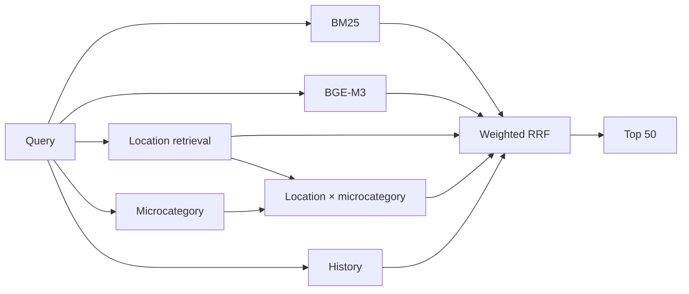

# Avito Data Science Bootcamp 2026 — Candidate Retrieval

**Hybrid retrieval for service-search candidate generation.**

> **Platform Recall@50: 0.831562**

| | |
| --- | --- |
| **Goal** | return 50 relevant listings per query |
| **Retrieval** | BM25 · BGE-M3 · location · microcategory · query history |
| **Fusion** | weighted Reciprocal Rank Fusion |
| **Validation** | query-disjoint tuning and verification slices |
| **Reproducibility** | deterministic asset builders + exact submitted file + SHA-256 |

## Pipeline



## Design choices

| Choice | Reason |
| --- | --- |
| lexical + semantic retrieval | complementary recall |
| explicit location search | service relevance is strongly geographic |
| microcategory restriction | reduces semantically adjacent but wrong services |
| query-history signals | recovers repeated and related demand patterns |
| RRF instead of score blending | rankers use incompatible score scales |
| held-out verification slice | avoids shipping tuning-only improvements |

Cross-encoder reranking, field-specific BM25, conditional geo priors and candidate transfer were tested but excluded when gains did not hold consistently.

## Repository map

| Path | Purpose |
| --- | --- |
| `solution.py` | final retrieval and fusion pipeline |
| `build_train_assets.py` | training embeddings + BM25 |
| `build_benchmark_assets.py` | benchmark embeddings + BM25 |
| `microcat_classifier.py` | query → microcategory model |
| `experiments/` | validation experiments |
| `check_submission.py` | submission validation |
| `answer.csv` | exact submitted file |

## Reproduce

```bash
python -m venv .venv
source .venv/bin/activate
pip install -r requirements.txt

python build_train_assets.py
python microcat_classifier.py
python build_benchmark_assets.py
python solution.py
python check_submission.py
```

Expected source data is documented in [data/README.md](data/README.md). Large parquet files, embeddings and indexes are intentionally excluded from Git.

## Submission integrity

```text
Recall@50: 0.831562
SHA-256: 093072acc21b856f79a982cf67b1d7ffa9f57252387c1b99b4cdea7c66f05cd6
```

CI checks Python syntax, diff hygiene and the submitted file hash.
