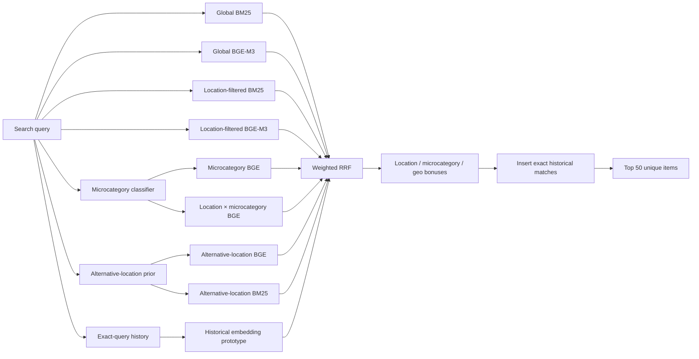

# Avito Data Science Bootcamp 2026 — Candidate Retrieval

Hybrid candidate-generation system for service search, combining lexical, semantic, geographic, categorical and historical signals.

> **Platform Recall@50: 0.831562**

| | |
| --- | --- |
| **Goal** | return 50 relevant listings for each search query |
| **Primary metric** | Recall@50 |
| **Lexical retrieval** | BM25 |
| **Semantic retrieval** | BGE-M3 |
| **Structured signals** | location · microcategory · query history |
| **Fusion** | weighted Reciprocal Rank Fusion |
| **Validation** | query-disjoint tuning + independent confirmation slices |
| **Submission integrity** | exact submitted file committed with SHA-256 |

## 1. Problem

For every benchmark query, the system must return exactly **50 unique item IDs** from the benchmark corpus.

The task is therefore not final ranking in the classic recommendation sense. It is **high-recall candidate generation**: the objective is to make sure relevant items are present in the top 50 so that a downstream ranker could operate on a strong candidate pool.

The final platform score is:

```text
Recall@50 = 0.831562
```

---

## 2. Data

The original competition data is intentionally not committed to Git because the parquet files and generated retrieval artifacts are large.

Expected source files:

```text
data/
├── train.parquet
├── benchmark_queries.parquet
└── benchmark_items.parquet
```

### Training data is used for

- repeated-query history;
- query → microcategory supervision;
- search-location → item-location statistics;
- historical item prototypes for warm queries;
- offline validation experiments.

### Benchmark query data is used for

- search text;
- optional query parameters;
- requested search location;
- output query IDs.

### Benchmark item data is used for

- item text;
- item location;
- item microcategory;
- candidate item IDs.

Generated heavy artifacts are also excluded from Git and can be rebuilt deterministically. See [data/README.md](data/README.md).

---

## 3. Retrieval architecture



The system is intentionally multi-channel: different retrievers recover different failure modes.

---

## 4. Offline asset preparation

### 4.1 Training-corpus assets

Run:

```bash
python build_train_assets.py
```

The script:

1. loads unique training items;
2. constructs two text representations;
3. creates normalized BGE-M3 embeddings;
4. stores item IDs in the exact embedding order;
5. builds a Russian-stemmed BM25 index.

Generated files:

```text
train_bge_embeddings.npy
train_bge_item_ids.npy
train_bm25_index/
```

### 4.2 Benchmark-corpus assets

Run:

```bash
python build_benchmark_assets.py
```

The same text-construction logic is applied to benchmark items.

Generated files:

```text
benchmark_bge_embeddings.npy
benchmark_bge_item_ids.npy
benchmark_bm25_index/
```

The scripts validate that saved embeddings and item-ID order remain aligned. This prevents one of the most dangerous retrieval bugs: using correct vectors with the wrong item IDs.

---

## 5. Item text representation

For BGE-M3, each item is represented as:

```text
title + parameters + truncated description
```

Descriptions are limited to the first 600 characters.

For BM25, the title is intentionally repeated:

```text
title + title + parameters + description
```

This gives the title more lexical weight without introducing a separate field-aware retrieval engine.

The same construction is used for train and benchmark corpora.

---

## 6. Semantic retrieval — BGE-M3

Model:

```text
BAAI/bge-m3
```

The encoder uses normalized embeddings and a maximum sequence length of 128.

### Global semantic search

For each query, the system computes a normalized query embedding and retrieves the top semantic candidates from the entire benchmark corpus.

```text
K_GLOBAL = 500
```

### Local semantic search

A location → item-index lookup is built once.

For each query, semantic search is repeated only inside items whose `item_location_id` matches the query's `search_location_id`.

This adds a geography-aware semantic channel without forcing geographic filtering on the global retriever.

---

## 7. Lexical retrieval — BM25

BM25 acts as an independent lexical signal.

Query text is built from:

```text
search_query + search_infm_params_text
```

Russian stemming is applied through PyStemmer.

A wide BM25 ranking is first retrieved:

```text
K_BM25_WIDE = 10000
```

From that one ranking the system derives:

- global BM25 candidates;
- exact-location BM25 candidates;
- alternative-location BM25 candidates.

This avoids rebuilding separate lexical indexes for every geographic slice.

---

## 8. Microcategory model

Some service queries are textually similar but belong to different microcategories. The system therefore trains a lightweight supervised query classifier.

Implementation:

```text
microcat_classifier.py
```

### Features

A FeatureUnion combines:

- word TF-IDF n-grams: 1–2;
- character TF-IDF n-grams: 3–5.

### Model

```text
LinearSVC(C=2.0)
```

### Leakage control

The train/validation split is performed with:

```python
GroupShuffleSplit(..., groups=df["search_query"])
```

The same query text therefore cannot appear in both train and validation partitions.

### Evaluation

The classifier is evaluated at:

```text
top-1
top-2
top-3
top-5
top-10
```

because the retrieval pipeline consumes several candidate microcategories rather than only the single top class.

The final pipeline uses:

```text
TOP_MICROCATS = 5
```

Generated assets:

```text
microcat_vectorizer.joblib
microcat_classifier.joblib
```

---

## 9. Historical-query signals

Training interactions provide information that text retrieval alone cannot reproduce.

### Exact-query history

Queries are normalized using lowercase, trimming and whitespace normalization.

For a repeated normalized query, item frequencies from the training data are aggregated. If historical item IDs also exist in the benchmark corpus, they are inserted before ordinary retrieved candidates.

This is a direct warm-query signal.

### Historical microcategories

For each normalized query, the most frequent historical microcategories are collected and combined with classifier-predicted microcategories.

### Historical embedding prototype

Exact historical items may not be available in the benchmark corpus. To transfer the historical signal to new items, the pipeline builds a prototype embedding:

```text
weighted mean of historical relevant-item embeddings
```

The vector is normalized and used as another semantic query against benchmark item embeddings.

Separate prototype weights are used depending on whether the query has only one historical item or multiple historical items.

---

## 10. Geographic retrieval

Exact location is not always sufficient: relevant service providers may come from nearby or commonly associated locations.

The system estimates:

```text
P(item_location | search_location)
```

from training interactions.

For each search location, the top alternative item locations are retained:

```text
GEO_TOP_N = 3
```

Those locations are then used in additional BGE and BM25 retrieval channels.

A small probability-weighted geographic bonus is also applied after RRF fusion.

---

## 11. Joint location × microcategory retrieval

The pipeline explicitly intersects structured constraints.

For predicted microcategories, it builds candidate pools for:

- exact query location × predicted microcategory;
- alternative location × predicted microcategory.

BGE similarity is then evaluated inside those restricted pools.

This is useful when semantic similarity alone returns adjacent but incorrect service types or geographically irrelevant results.

---

## 12. Fusion

The retrieval channels produce scores on incompatible scales.

For example:

- BM25 scores are lexical relevance values;
- BGE uses cosine-equivalent similarity from normalized embeddings;
- historical prototype search is another semantic ranking;
- location channels are filtered rankings.

Direct score averaging would therefore require calibration across heterogeneous systems.

The project uses **weighted Reciprocal Rank Fusion**:

```text
score(item) += weight / (RRF_K + rank)
```

with:

```text
RRF_K = 60
```

This makes the fusion depend primarily on rank position rather than raw score scale.

### Current principal weights

```text
Global BGE                 1.00
Local BGE                  0.25
Local BM25                 1.25
Microcategory BGE          0.25
Alternative-location BGE   0.25
Alternative-location BM25  0.50
Exact loc × microcat BGE   0.50
Alt loc × microcat BGE     0.25
```

Exact historical matches and historical prototypes are handled separately because they represent stronger query-specific prior evidence.

---

## 13. Post-fusion structured bonuses

After RRF, small additive priors are applied.

### Exact location bonus

```text
LOCATION_BONUS = 0.020
```

### Microcategory bonus

```text
MICROCAT_BONUS = 0.010
```

### Geographic-prior bonus

```text
GEO_WEIGHT × P(item_location | search_location)
```

The bonuses are intentionally small: they adjust the ordering without replacing the retrieval evidence.

---

## 14. Final top-50 construction

For each query:

1. build all retrieval rankings;
2. fuse rankings with weighted RRF;
3. apply structured bonuses;
4. sort the fused candidates;
5. insert exact historical item matches where available;
6. remove duplicates;
7. take 50 items;
8. backfill from the wide BM25 ranking if fewer than 50 remain.

The result is written to:

```text
answer.csv
```

---

## 15. Validation methodology

The repository contains dedicated experimental scripts under:

```text
experiments/
```

The core principle is **query-disjoint validation**.

Where the main training interactions are split into train/validation subsets, `GroupShuffleSplit` groups by `search_query`, preventing the same query text from leaking into both sides.

For selected experiments, the validation pool is then split again into:

- a tuning slice;
- an independent confirmation slice.

For example, joint-retrieval experiments use fixed, shuffled ranges for tuning and confirmation rather than selecting and reporting on the same slice.

This makes experimental gains harder to obtain by accidental overfitting.

---

## 16. Experiment discipline

The experiment scripts are structured to change one retrieval component at a time while holding the rest of the pipeline fixed.

Examples include:

- alternative geographic retrieval;
- independent geographic-prior weighting;
- joint location × microcategory retrieval;
- historical prototype retrieval;
- separate history weight for singleton histories.

For each tested configuration, scripts can report not only mean Recall@50 but also:

- number of improved queries;
- number of worsened queries;
- number of changed queries;
- average number of replaced candidates.

This helps distinguish a broad improvement from a gain caused by a small number of outlier queries.

Approaches that did not hold consistently were not kept in the final pipeline.

---

## 17. Approaches tested but not retained

The project explored additional ideas including:

- cross-encoder reranking;
- field-specific BM25 variants;
- alternative geographic priors;
- candidate-transfer variants;
- different historical weighting strategies.

The final implementation keeps only components whose validation behavior was sufficiently stable.

This repository therefore represents the **selected system**, while `experiments/` preserves evidence of the search process.

---

## 18. Reproduction

Create an environment:

```bash
python -m venv .venv
source .venv/bin/activate
pip install -r requirements.txt
```

Place the original parquet files under `data/`.

Then run:

```bash
python build_train_assets.py
python microcat_classifier.py
python build_benchmark_assets.py
python solution.py
python check_submission.py
```

Pipeline order matters because later stages depend on artifacts built by earlier stages.

---

## 19. Submission validation

`check_submission.py` checks:

- columns are exactly `query_id` and `answer`;
- row count equals benchmark query count;
- query order is unchanged;
- every query has exactly 50 IDs;
- all 50 IDs are unique;
- every returned ID exists in the benchmark item corpus.

These checks protect against silent formatting errors that can destroy an otherwise correct retrieval submission.

---

## 20. Submission integrity

The exact submitted file is committed.

```text
Recall@50: 0.831562
SHA-256: 093072acc21b856f79a982cf67b1d7ffa9f57252387c1b99b4cdea7c66f05cd6
```

GitHub Actions checks Python syntax, diff hygiene and the `answer.csv` SHA-256 on pull requests.

This separates the documented platform score from later code edits: the committed hash identifies the exact submission associated with the reported score.

---

## 21. Repository map

| Path | Purpose |
| --- | --- |
| `solution.py` | final multi-source retrieval and fusion pipeline |
| `build_train_assets.py` | training BGE embeddings + BM25 index |
| `build_benchmark_assets.py` | benchmark BGE embeddings + BM25 index |
| `microcat_classifier.py` | query → microcategory model |
| `experiments/` | controlled validation experiments |
| `check_submission.py` | final output contract checks |
| `data/README.md` | source-data and generated-artifact contract |
| `answer.csv` | exact submitted output |
| `.github/workflows/syntax.yml` | repository integrity checks |

---

## 22. Limitations

- The original competition data is not distributed in this repository.
- BGE-M3 embedding generation is computationally expensive on CPU.
- Several historical signals are most useful for warm/repeated queries.
- The microcategory classifier depends on labels available in the training data.
- RRF weights are empirically tuned rather than learned end to end.
- Recall@50 measures candidate coverage, not final presentation quality.
- The platform score reflects one fixed benchmark and should not be generalized to arbitrary search traffic.

The project is intended to demonstrate **retrieval-system design, hybrid search, leakage-aware validation, experiment control, reproducible asset generation and submission integrity**.
