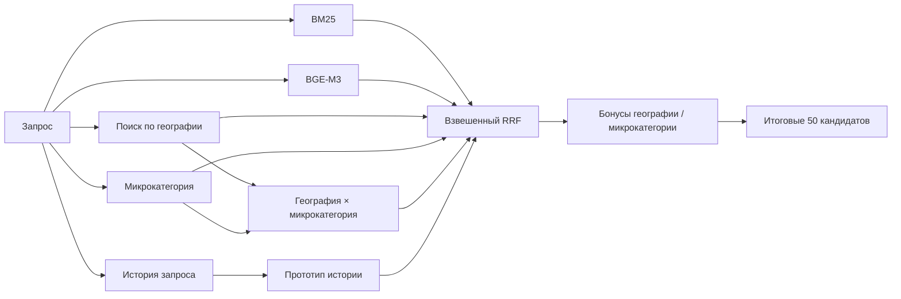

# Avito Data Science Bootcamp 2026 — Поиск кандидатов

Гибридная система генерации кандидатов для поиска услуг.

> **Recall@50 на платформе: 0.831562**

| | |
| --- | --- |
| **Задача** | вернуть 50 релевантных объявлений для каждого запроса |
| **Метрика** | Recall@50 |
| **Поиск** | BM25 · BGE-M3 · география · микрокатегория · история запросов |
| **Объединение** | взвешенный Reciprocal Rank Fusion |
| **Валидация** | разбиение без пересечения запросов + отдельные срезы подбора и проверки |
| **Воспроизводимость** | детерминированная сборка артефактов + точный отправленный файл |

## Задача

Для каждого поискового запроса система должна вернуть ровно **50 уникальных item_id** из тестового корпуса.

Цель — получить кандидатный пул с высокой полнотой: найти как можно больше релевантных объявлений до возможного последующего этапа ранжирования.

## Данные

Ожидаемые исходные файлы:

```text
data/
├── train.parquet
├── benchmark_queries.parquet
└── benchmark_items.parquet
```

Обучающая выборка используется для истории запросов, обучения модели микрокатегорий, географической статистики и офлайн-валидации. Тестовые файлы задают поисковые запросы и корпус объявлений-кандидатов.

Большие parquet-файлы, эмбеддинги и BM25-индексы намеренно не хранятся в Git и пересобираются локально. Подробнее — в [data/README.md](data/README.md).

## Пайплайн поиска



### BM25

Даёт лексический канал поиска по тексту запроса и дополнительным параметрам. Используется русский стемминг, а один широкий список кандидатов переиспользуется для глобального и географически ограниченного поиска.

### BGE-M3

Даёт семантический поиск по нормализованным эмбеддингам объявлений. Используется как глобальный поиск, так и поиск внутри точной или вероятной альтернативной географии.

### Микрокатегория

Лёгкая модель TF-IDF + LinearSVC предсказывает наиболее вероятные микрокатегории услуги. Валидация группируется по `search_query`, поэтому один и тот же текст запроса не может попасть одновременно в обучающую и валидационную части.

### География

По обучающим взаимодействиям система оценивает вероятные `item_location` для каждого `search_location` и использует их как дополнительные каналы поиска и небольшие априорные бонусы после объединения результатов.

### История запросов

Для повторяющихся запросов используются точные исторические объявления, исторические микрокатегории и прототип-эмбеддинг, построенный по ранее релевантным объявлениям.

## Объединение результатов

Разные поисковые каналы возвращают оценки в несовместимых шкалах, поэтому система объединяет **позиции в ранжированных списках**, а не исходные численные оценки:

```text
score(item) += weight / (RRF_K + rank)
RRF_K = 60
```

После RRF добавляются небольшие бонусы за географию, микрокатегорию и географическую априорную вероятность.

На финальном этапе удаляются дубликаты, при наличии добавляются корректные исторические совпадения, а недостающие позиции дополняются кандидатами из BM25 до ровно 50 объявлений.

## Валидация и эксперименты

Главный принцип — **валидация без пересечения одинаковых запросов**.

`GroupShuffleSplit` группирует данные по `search_query`, поэтому одинаковый текст запроса не может попасть одновременно в обучающую и валидационную части. Для части экспериментов дополнительно используются отдельные срезы подбора и независимой проверки.

В директории `experiments/` отдельные изменения проверяются при фиксированном остальном пайплайне, в том числе:

- поиск по альтернативной географии;
- настройка географического приора;
- поиск по сочетанию географии и микрокатегории;
- поиск по историческому прототипу;
- разные веса исторического сигнала.

Эксперименты учитывают не только средний Recall@50, но и число улучшившихся и ухудшившихся запросов. Компоненты, которые не давали стабильного прироста, в финальный пайплайн не включались.

## Подготовка артефактов

```bash
python build_train_assets.py
python microcat_classifier.py
python build_benchmark_assets.py
```

Скрипты создают:

```text
train_bge_embeddings.npy
train_bge_item_ids.npy
train_bm25_index/

microcat_vectorizer.joblib
microcat_classifier.joblib

benchmark_bge_embeddings.npy
benchmark_bge_item_ids.npy
benchmark_bm25_index/
```

При сборке проверяется, что строки эмбеддингов соответствуют правильному порядку item_id.

## Воспроизведение решения

```bash
python -m venv .venv
source .venv/bin/activate
pip install -r requirements.txt

python build_train_assets.py
python microcat_classifier.py
python build_benchmark_assets.py
python solution.py
python check_submission.py
```

`check_submission.py` проверяет порядок запросов, наличие ровно 50 уникальных кандидатов на каждый запрос и то, что все возвращаемые item_id существуют в тестовом корпусе.

## Целостность отправленного решения

```text
Recall@50: 0.831562
SHA-256: 093072acc21b856f79a982cf67b1d7ffa9f57252387c1b99b4cdea7c66f05cd6
```

Точный отправленный файл `answer.csv` сохранён в репозитории. CI проверяет синтаксис Python, корректность изменений и SHA-256 итогового файла.

## Структура репозитория

| Путь | Назначение |
| --- | --- |
| `solution.py` | финальный пайплайн поиска и объединения кандидатов |
| `build_train_assets.py` | эмбеддинги и BM25 для обучающей выборки |
| `build_benchmark_assets.py` | эмбеддинги и BM25 для тестового корпуса |
| `microcat_classifier.py` | модель запрос → микрокатегория |
| `experiments/` | контролируемые валидационные эксперименты |
| `check_submission.py` | проверка итогового файла |
| `data/README.md` | описание входных данных и генерируемых артефактов |
| `answer.csv` | точный отправленный файл |

## Ограничения

- Исходные данные соревнования не распространяются в этом репозитории.
- Генерация BGE-M3-эмбеддингов без GPU или другого ускорителя занимает заметное время.
- Исторические сигналы в основном полезны для повторяющихся запросов.
- Веса RRF подобраны экспериментально, а не обучены совместно со всей системой.
- Recall@50 измеряет полноту кандидатного пула, а не качество финального ранжирования.
