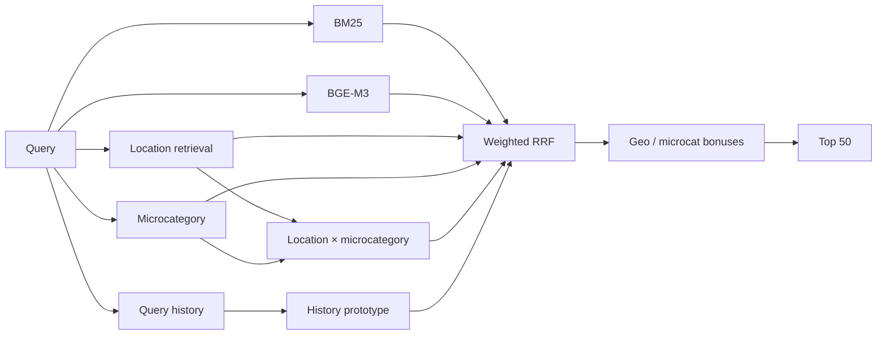

# Avito Data Science Bootcamp 2026 — Candidate Retrieval

Hybrid candidate-generation system for service search.

> **Platform Recall@50: 0.831562**

| | |
| --- | --- |
| **Goal** | return 50 relevant listings per query |
| **Metric** | Recall@50 |
| **Retrieval** | BM25 · BGE-M3 · location · microcategory · history |
| **Fusion** | weighted Reciprocal Rank Fusion |
| **Validation** | query-disjoint tuning + independent confirmation slices |
| **Reproducibility** | deterministic asset builders + exact submitted file |

## Problem

For each search query, the system must return exactly **50 unique item IDs** from the benchmark corpus.

The objective is high-recall candidate generation: retrieve as many relevant listings as possible before a potential downstream ranking stage.

## Data

Expected source files:

```text
data/
├── train.parquet
├── benchmark_queries.parquet
└── benchmark_items.parquet
```

Training data is used for query history, microcategory supervision, geographic statistics and offline validation. Benchmark files define the queries and candidate item corpus.

Large parquet files, embeddings and BM25 indexes are intentionally excluded from Git and rebuilt locally. See [data/README.md](data/README.md).

## Retrieval pipeline



### BM25

Provides the lexical channel using query text plus optional parameters. Russian stemming is applied, and a wide ranking is reused for global and location-filtered retrieval.

### BGE-M3

Provides semantic retrieval over normalized item embeddings. The pipeline uses both global search and search restricted to exact or likely alternative locations.

### Microcategory

A lightweight TF-IDF + LinearSVC model predicts likely service microcategories. Validation is grouped by `search_query` so the same query text cannot appear in both train and validation.

### Geography

The system estimates likely item locations for each search location from training interactions and uses them as extra retrieval channels and small post-fusion priors.

### Query history

Repeated queries contribute exact historical items, historical microcategories and a prototype embedding built from previously relevant items.

## Fusion

Different retrievers produce scores on incompatible scales, so the system combines **rank positions** instead of raw scores:

```text
score(item) += weight / (RRF_K + rank)
RRF_K = 60
```

Small location, microcategory and geographic-prior bonuses are applied after fusion.

The final stage removes duplicates, inserts valid historical matches where available and backfills from BM25 until exactly 50 items remain.

## Validation and experiments

The core rule is **query-disjoint validation**.

`GroupShuffleSplit` groups by `search_query`, preventing identical query text from leaking across train and validation. Several experiments then use separate tuning and confirmation slices.

The `experiments/` directory tests individual additions while keeping the rest of the pipeline fixed, including:

- alternative geographic retrieval;
- geographic-prior weighting;
- location × microcategory retrieval;
- historical prototype retrieval;
- history-weight variants.

Experiments track not only mean Recall@50 but also how many queries improve or regress. Components that did not hold consistently were not retained.

## Asset preparation

```bash
python build_train_assets.py
python microcat_classifier.py
python build_benchmark_assets.py
```

These scripts build:

```text
train_bge_embeddings.npy
train_bge_item_ids.npy
train_bm25_index/

microcat_vectorizer.joblib
microcat_classifier.joblib

benchmark_bge_embeddings.npy
benchmark_bge_item_ids.npy
benchmark_bm25_index/
```

The builders verify that embedding rows remain aligned with the corresponding item IDs.

## Reproduce the submission

```bash
python -m venv .venv
source .venv/bin/activate
pip install -r requirements.txt

python build_train_assets.py
python microcat_classifier.py
python build_benchmark_assets.py
python solution.py
python check_submission.py
```

`check_submission.py` verifies query order, exactly 50 unique candidates per query and that all returned IDs exist in the benchmark corpus.

## Submission integrity

```text
Recall@50: 0.831562
SHA-256: 093072acc21b856f79a982cf67b1d7ffa9f57252387c1b99b4cdea7c66f05cd6
```

The exact submitted `answer.csv` is committed. CI checks Python syntax, diff hygiene and the submission hash.

## Repository map

| Path | Purpose |
| --- | --- |
| `solution.py` | final retrieval + fusion pipeline |
| `build_train_assets.py` | train embeddings + BM25 |
| `build_benchmark_assets.py` | benchmark embeddings + BM25 |
| `microcat_classifier.py` | query → microcategory model |
| `experiments/` | controlled validation experiments |
| `check_submission.py` | output validation |
| `data/README.md` | data / artifact contract |
| `answer.csv` | exact submitted file |

## Limitations

- Original competition data is not distributed in the repository.
- BGE-M3 asset generation is expensive without an accelerator.
- Historical signals mainly help warm/repeated queries.
- RRF weights are empirically tuned rather than learned end to end.
- Recall@50 measures candidate coverage, not final ranking quality.
